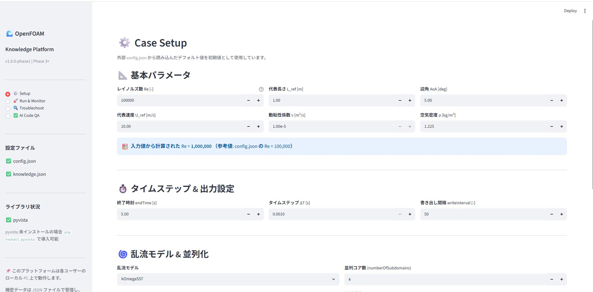
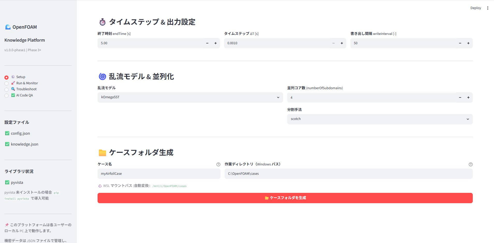
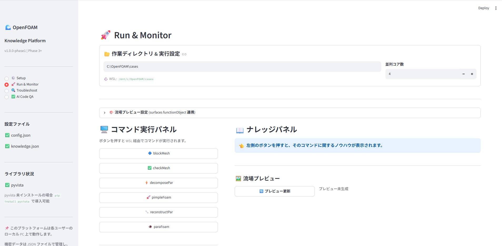
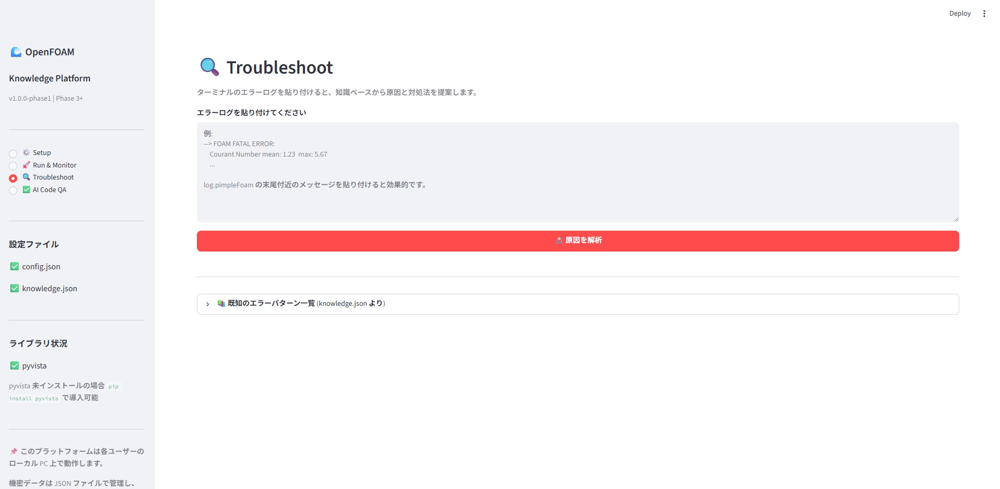
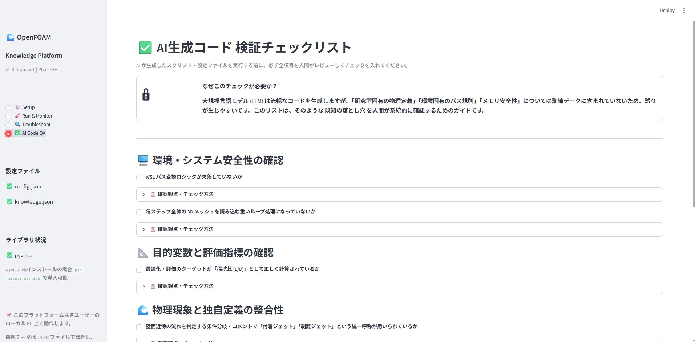
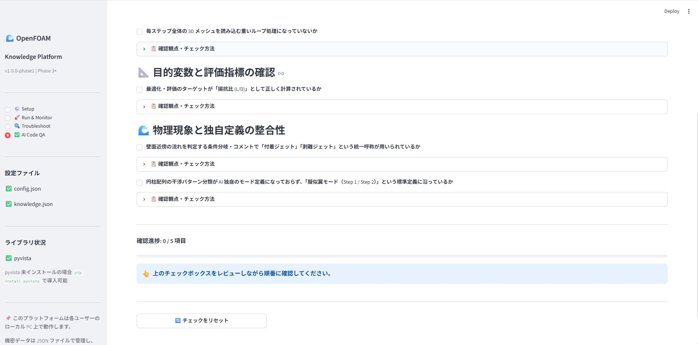

# 🌊 OpenFOAM Knowledge Platform

**🌐 言語:** [English](README.en.md) | **日本語**

> 流体解析ソフト **OpenFOAM** の操作を GUI で完結させ、組織のノウハウを共有するための統合プラットフォーム

[](https://www.python.org/)
[](https://streamlit.io/)
[](LICENSE)

---

### ⚙️ Setup — ケースパラメータ設定
`config.json` から読み込んだデフォルト値を初期値として各入力欄に表示。レイノルズ数・代表速度・動粘性係数から Re を自動計算し、乱流モデルや並列コア数を選択できる。




---

### 🚀 Run & Monitor — コマンド実行 & ナレッジパネル
左カラムのボタンを押すと WSL 経由で OpenFOAM コマンドを実行。右カラムには `knowledge.json` から読み込んだそのコマンド固有のノウハウ・注意事項をリアルタイムで表示する。



---

### 🔍 Troubleshoot — エラーログ解析
ターミナルのエラーログを貼り付けてボタンを押すと、`knowledge.json` に定義したキーワードパターンとマッチングし、原因と対処法を提示する。Run 画面で保存された実行ログをワンクリックで読み込むことも可能。



---

### ✅ AI Code QA — AI生成コード 安全性検証チェックリスト
AI が生成したスクリプトや設定ファイルを実運用する前の「関所」。5項目すべてにチェックが入ると `st.success` で実行許可が表示される。各項目には折りたたみ式の詳細確認手順を配置。




---

## 🎯 開発背景と狙い

### 課題：Scrapbox による知識のサイロ化

研究室ではこれまで、解析ノウハウの記録に Scrapbox を活用してきました。個々の作業メモとしては有効に機能していたものの、「他のメンバーのページを積極的に読みに行く機会が少ない」という課題がありました。その結果、実践的な解析手法の共有が進まず、知識が個人の中に閉じてしまう、いわゆる属人化が生じていました。

### 解決策：「読む共有」から「実行に溶け込む共有」へ

この問題を解決するために、「記録を読むことで共有する」という受動的な方法から、「解析を実行する過程そのものにノウハウを組み込む」という新しいアプローチを目指しました。そこで、OpenFOAM を利用する研究室メンバー向けに、解析作業の中で自然と知識が共有されるプラットフォームを開発しました。

### 一番の工夫：AIハルシネーション（物理的誤謬）への徹底対策

本プラットフォームは、**AIを活用しながら開発** しました。近年、研究をはじめコーディングを伴う場面でAIを用いて開発を進めることが急速に増えています。私の研究室でも例外ではなく、AIの支援を受けながら解析コードを書く機会が今後さらに広がっていくと考えられます。

その流れの中で痛感したのが、AIの「もっともらしい嘘」への対策の重要性でした。

**リスクの認識**：AIはコーディングには強い一方で、研究室独自の物理定義（揚抗比、擬似翼モードなど）を知りません。そのため、一見もっともらしいものの、実際には誤った前提に基づくコード（ハルシネーション）を生成してしまうことがあります。

**システムによる対策（AI Code QA）**：この問題に対し、AIが生成したコードを人間が必ず検証する **「検証チェックリスト」** を実装しました。

- **必須項目のチェック**：「揚抗比」を重視しているか、「付着ジェット／剥離ジェット」の呼称が正しいか、「擬似翼モード」の分類に沿っているかなど、研究室独自の知見をチェック項目として組み込みました。
- **安全装置**：すべてのチェックを通過しない限り、実行を承認しない仕組みとしました。

> ⚠️ 上記の物理定義（揚抗比・付着/剥離ジェット・擬似翼モードなど）は、機能を説明するための **サンプル項目** です。実運用では各チームが自分たちの評価基準や用語定義を `app.py` 内の `_QA_CHECKS`（将来的には `knowledge.json`）に登録して使う想定です。

このように **チェック項目（定義そのもの）をコードから分離し、後から差し替えられる設計** にすることで、AIの誤りを人間が確実に食い止める「関所」を、どの研究テーマにも応用できる形で実現しました。

### 狙いと今後の展望

直感的なフロントエンドを導入したことで、コマンドライン操作やプログラミング経験が浅いメンバーでも容易に解析に取り組めるようになることを狙いとして設計しました。ツールを使う過程でノウハウが共有され、研究室全体の生産性向上につながることを目指しています。

なお、現時点では自身の環境での開発・動作検証を終えた段階であり、研究室への本格的な展開はこれからです。今後の運用と機能拡張を通じて、学習コストの低減と解析品質の標準化に寄与していくことを目指していきます。

---

## 🛠 技術スタック・実装のポイント

| 技術 | ざっくり言うと | 用途 |
| :--- | :--- | :--- |
| **Streamlit** | Pythonだけで画面を作れる道具 | Web GUI フレームワーク（サーバー不要・ローカル完結） |
| **subprocess + WSL** | Windowsから裏でLinuxを動かす | OpenFOAMコマンドの安全な実行とエラーハンドリング |
| **正規表現** | ログから必要な数値だけ拾う | pimpleFoamの出力をリアルタイムで読み取り残差値を抽出 |
| **matplotlib (Agg)** | 計算結果をグラフ・画像にする | 断面データを軽い2D画像に変換（メモリ解放処理込み） |
| **pandas** | 表形式のデータを扱う | 残差の時系列データを管理し、対数軸グラフで可視化 |
| **JSON** | 設定を別ファイルに切り出す | パラメータ・ノウハウを外部管理しハードコードを回避 |

### 設計上のこだわり

単に動くものを作るだけでなく、実際に研究室で使うことを想定して、つまずきやすいポイントを先回りして対策しました。

- **メモリ安全設計**
  重い3Dデータをすべて読み込むとPCが固まってしまうため、軽い2D断面の画像だけを表示するようにしています。具体的には、全体メッシュは Python 側で読み込まず `postProcessing/surfaces/` の2D断面データのみを使い、プレビューの更新も `step % N == 0` の間引き制御で負荷を抑えています。

- **WSL パス変換**
  WindowsとLinux（WSL）ではフォルダの書き方が違う（`C:\foo` と `/mnt/c/foo`）ため、これを自動変換する処理を入れました。`PureWindowsPath` を用いて `C:\foo\bar` → `/mnt/c/foo/bar` に変換することで、WindowsアプリからWSL上のOpenFOAMをそのまま操作できます。

- **機密データ分離**
  研究室の固有情報をコードに直接書かず、別ファイルに分けてGitHubには上げない設計にしました。固有のパラメータやノウハウは `*.json` で外部管理し、`app.py` 本体にはハードコードしません。実データ用のファイルは `.gitignore` で Git 管理から除外しています。

---

## 🗺 開発ロードマップ

| バージョン | 内容 | 状態 |
| :--- | :--- | :--- |
| **v0.1** | UI モックアップ・JSON 読み込み・レイアウト | ✅ 完了 |
| **v0.2** | `subprocess` による WSL 連携コマンド実行・エラーハンドリング | ✅ 完了 |
| **v0.3** | 残差リアルタイム監視・流場スライス画像プレビュー | ✅ 完了 |
| **v1.0** | AI生成コード安全性検証チェックリスト画面（初回安定版） | ✅ 完了 |
| **v1.1** | ケーステンプレート自動生成・実揚抗力グラフ読み込み | 🚧 継続中 |

---

## 🚀 セットアップ・起動方法

### 前提条件
- Windows 11 + WSL2（Ubuntu 22.04 推奨）
- WSL 側に OpenFOAM がインストール済み
- Python 3.10 以上

### インストール

```bash
git clone https://github.com/<your-username>/openfoam-knowledge-platform.git
cd openfoam-knowledge-platform
pip install -r requirements.txt
```

### 起動

```bash
streamlit run app.py
```

ブラウザで `http://localhost:8501` が開きます。

---

## 📁 ファイル構成

```
.
├── app.py              # メインアプリ（全機能・約1600行）
├── config.json         # デフォルトパラメータ（ダミー値・公開用）
├── knowledge.json      # コマンドノウハウ・トラブルパターン（ダミー値・公開用）
├── requirements.txt    # 依存ライブラリ
├── docs/               # README 用スクリーンショット
└── README.md
```

> **セキュリティ方針**：
> 実運用時の機密パラメータは `config.local.json` / `knowledge.local.json` に保存し、
> `.gitignore` によって Git 管理対象から除外しています。

---

## 📄 ライセンス

MIT License — 詳細は [LICENSE](LICENSE) を参照してください。
